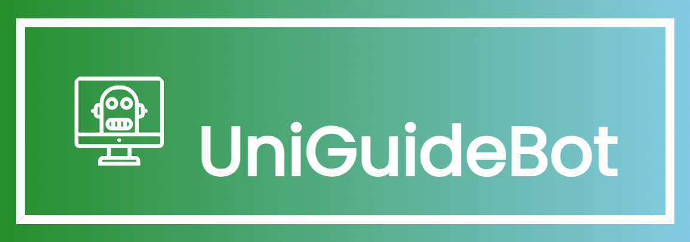

# 🤖 UniGuideBot 🎓

UniGuideBot is a Flask-based chatbot application designed to provide information about university services and resources. It's one of my tasks as an Artificial Intelligence Intern at the virtual internship from [TeknoSoft](https://www.linkedin.com/company/teknosoft/?lipi=urn%3Ali%3Apage%3Ad_flagship3_search_srp_all%3BRwo7ne%2B7QICcRh9Ck7Jclw%3D%3D).

## Installation
1. Clone this repository.
2. Install Python 3.x if you haven't already.
3. Install the required Python packages.
4. Run the Flask app using `python init.py`.

## Made by: Abdelrahman Eldaba 👨‍💻
- Check out my website with a portfolio [Here](https://sites.google.com/view/abdelrahman-eldaba110) 🌟
- Connect with me on [LinkedIn](https://www.linkedin.com/in/abdelrahmaneldaba) 🌐
- Look at my [GitHub](https://github.com/Abdelrahman47-code) 🚀
